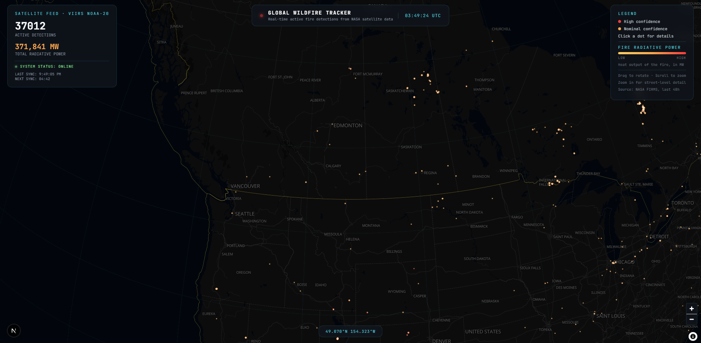
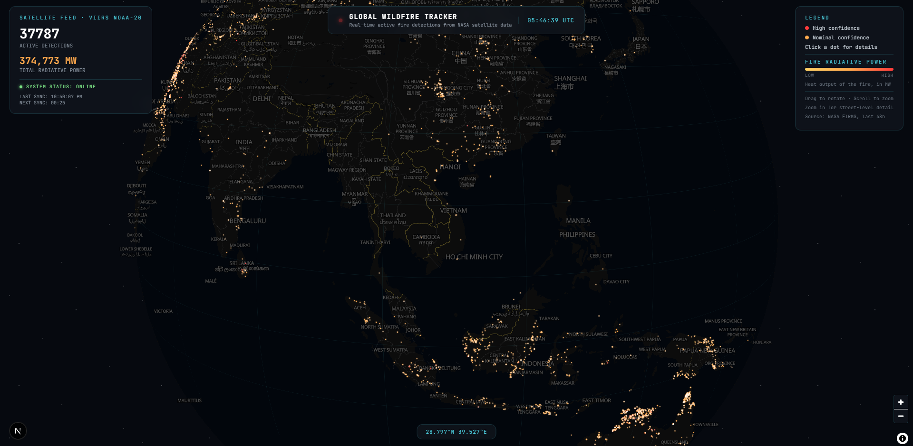
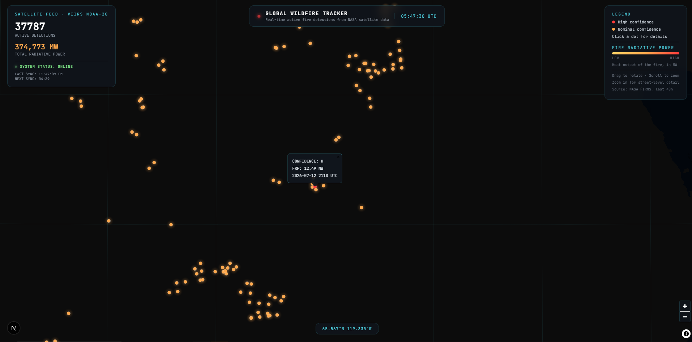

# 🔥 Global Wildfire Tracker

A real-time, satellite-driven wildfire monitoring dashboard built with Next.js and MapLibre GL, visualizing active fire detections from NASA's FIRMS (Fire Information for Resource Management System) VIIRS satellite feed.

**[Live Demo →](https://wildfiremonitor.vercel.app)**






---

## Why I Built This

I grew up in Calgary, Alberta — a city that, in recent years, has spent entire stretches of summer wrapped in wildfire smoke drifting in from across the province and neighboring British Columbia. Some mornings the sky turns orange before you've even had coffee. Air quality alerts become routine. School outdoor activities get cancelled. It's a strange thing to watch a city adjust its daily rhythm around smoke that started burning hundreds of kilometers away.

That distance is what stuck with me. The fire causing the smog over my house might be three provinces away, invisible, and yet its effects show up on my street. I wanted to build something that closes that gap — a way to actually *see* where fires are burning in near real time, not just feel their downstream effects.

Global Wildfire Tracker pulls live satellite fire detection data and renders it on an interactive 3D globe, so anyone — a concerned resident, a student, a researcher — can look at the planet and immediately understand where active fire activity is concentrated, how intense it is, and how it's trending.

## What It Does

- **Real-time fire detections** — Pulls active fire data from NASA FIRMS (VIIRS NOAA-20 satellite), auto-refreshing every 5 minutes
- **Fire Radiative Power (FRP) tracking** — Surfaces total radiative output in megawatts, a proxy researchers use for fire intensity, not just fire count
- **Confidence-weighted visualization** — Distinguishes high-confidence vs. nominal-confidence detections, since satellite fire detection carries inherent classification uncertainty
- **Interactive 3D globe** — Built on MapLibre GL's globe projection, so global fire distribution patterns (fire season migration, hemispheric trends) are immediately visible
- **Detailed detection popups** — Click any detection point for confidence level, FRP, and acquisition timestamp
- **Mobile-first responsive HUD** — Collapsible legend and adaptive stat panels for use on any device

## Who It's For

- **Researchers and scientists** studying fire behavior, smoke transport, or climate-linked fire frequency trends, who need a fast, accessible way to spot-check current global fire activity without digging through raw FIRMS data exports
- **The general public**, especially in wildfire-prone regions like Alberta, who want a clearer picture of *why* the air looks the way it does on a given day
- **Students and educators** using live environmental data as a teaching tool for climate science, geography, or data visualization
- **Journalists and policy researchers** tracking fire activity during active wildfire seasons

## Tech Stack

| Layer | Technology |
|---|---|
| Framework | Next.js (App Router) |
| Mapping | MapLibre GL JS, Maplibre Graticule |
| Data Source | NASA FIRMS (VIIRS NOAA-20 active fire product) |
| Language | TypeScript / React |
| Styling | Custom CSS (HUD-style interface) |
| Deployment | Vercel |

## Data Source & Attribution

Fire detection data is sourced from NASA's **Fire Information for Resource Management System (FIRMS)**, using the VIIRS NOAA-20 near-real-time active fire product. Detections reflect satellite passes over the last 48 hours and are subject to the confidence and resolution limitations inherent to satellite-based fire detection (e.g., cloud cover, small/low-intensity fires may not be captured).

> This project is for informational and educational purposes and is not an authoritative source for emergency response or evacuation decisions. For official alerts, consult your local emergency services or fire authority.

## Getting Started

```bash
git clone https://github.com/Duskofnight/fire-map.git
cd fire-map
npm install
npm run dev
```

Open [http://localhost:3000](http://localhost:3000) to view it locally.

## Roadmap

- [ ] Historical playback (view fire spread over time)
- [ ] Smoke plume overlay using air quality data
- [ ] Region-specific alerts/subscriptions
- [ ] Export detection data as CSV/GeoJSON for researchers

## License

MIT — free to use, modify, and build on.

---

*Built by [Victor Phan](https://github.com/Duskofnight) in Calgary, Alberta.*
